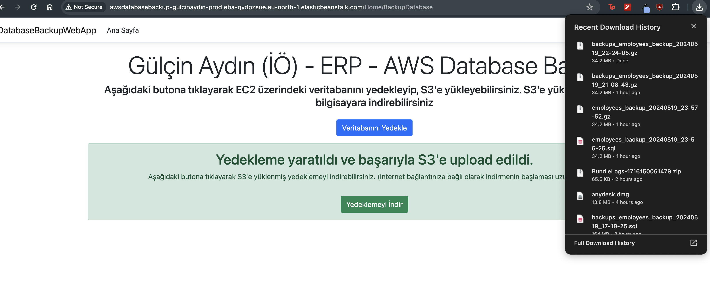
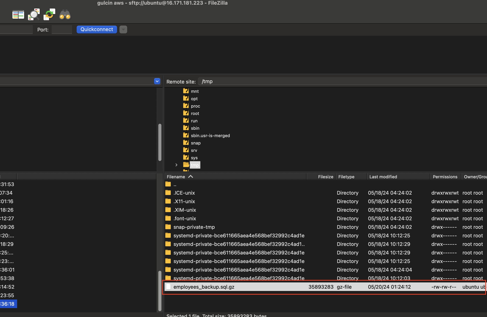
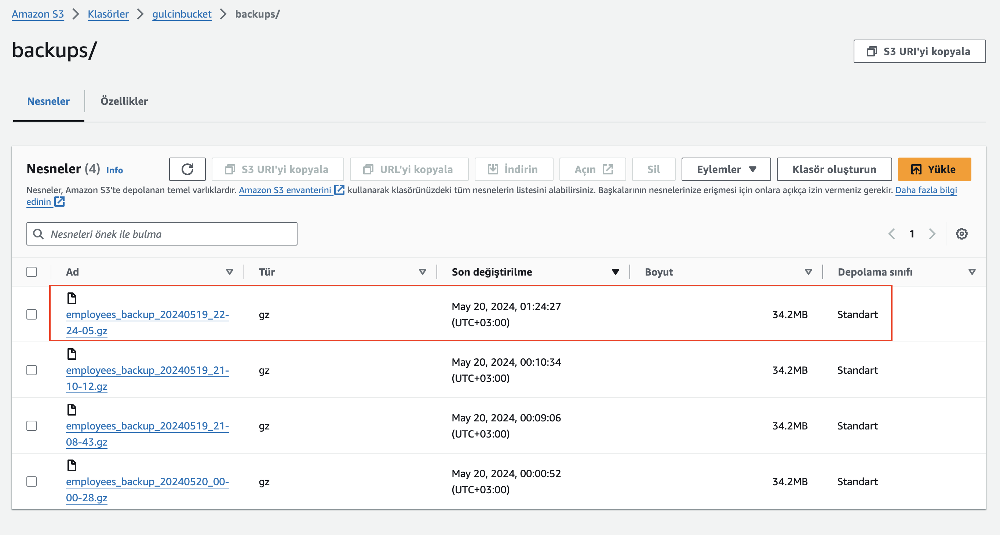
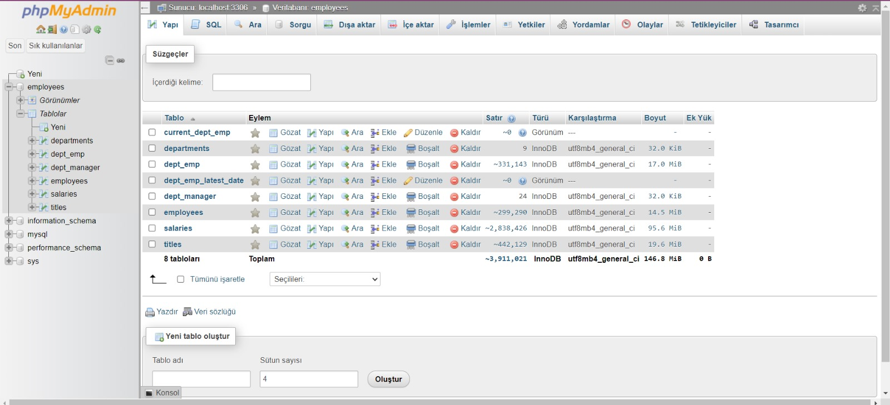

# AWS Database Backup App

Yukarýdaki proje ile, **AWS EC2** hizmeti üzerinde yüklü olan mariaDB veritabanýndaki **employees** veritabaný phpMyAdmin ile yönetilebilmektedir. Employees veritabaný **S3** hizmetine yedeklenebilmekte ve bilgisayara indirilebilmektedir.  

 - EC2 hizmetinde yüklü olan ubuntu server'da bir sql backup'ý oluþturulur.
 - Bu sql backup'ý ziplenerek boyutunun küçültülmesi saðlanýr.
 - Ziplenmiþ dosya S3'e yüklenir.
 - Yüklenmiþ dosya bilgisayara indirilebilir.
 - Tüm bunlarýn yapýlabildiði projemiz de AWS üzerinde publish edildi.

(Projenin çalýþtýrýlabilmesi için, AccessKey ve AccessSecret'ýn appsettings'e eklenmesi gerekmektedir.)
 
### Projenin canlý haline aþaðýdaki linkten eriþebilirsiniz.

[Proje linki](http://awsdatabasebackup-gulcinaydin-prod.eba-qydpzsue.eu-north-1.elasticbeanstalk.com/)

### EC2 Ubuntu Server üzerinde oluþturulup zip haline getirilmiþ sql backup'ý

### S3'e yüklenmiþ zip dosyasý

### PhpMyAdmin Employees Örnek Veritabaný

